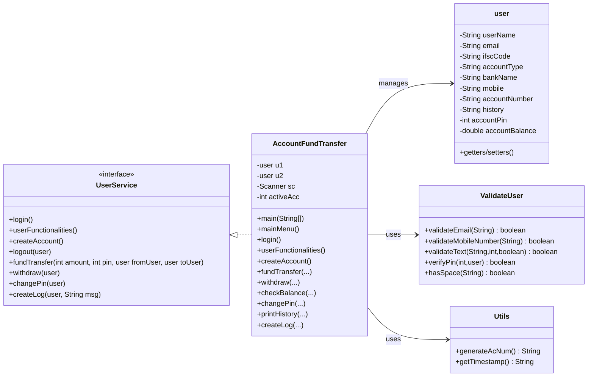
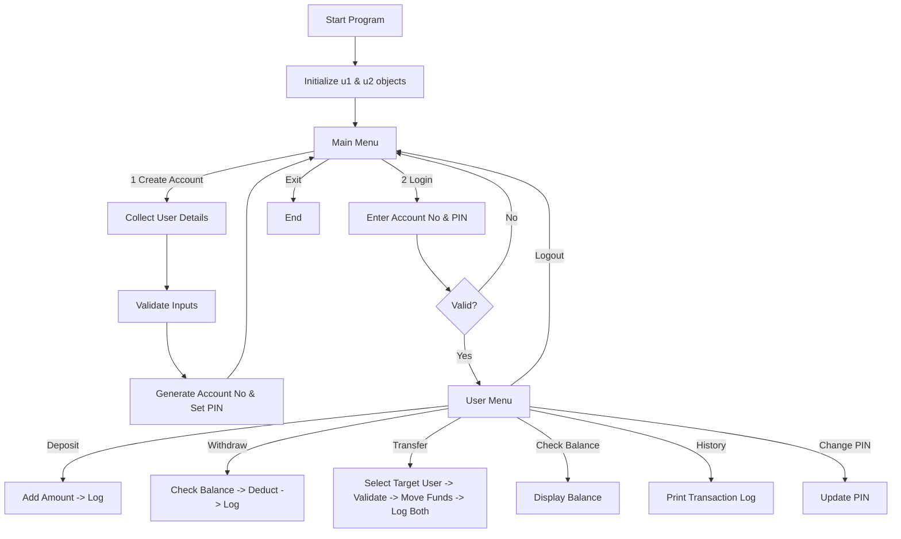

# 💳 Bank Management System – Java OOP

[](https://www.oracle.com/java/)
[](#)
[](#license)
[](https://github.com/AtharvaVirkar/Bank-Management-OOPS/stargazers)
[](https://github.com/AtharvaVirkar/Bank-Management-OOPS/network/members)

---

> **Learning / Academic Project:** A console‑based *Bank Management & Fund Transfer* system implemented in **Java** to demonstrate **Object‑Oriented Programming (OOP)** principles.  
> Includes *account creation, PIN‑secured login, deposits, withdrawals, inter‑account fund transfer, balance inquiry,* and a simple in‑memory *transaction history log*.  
> Designed for students (SPPU style) and early Java learners who want a clear, exam‑friendly, extensible codebase.

---

## 📚 Table of Contents
- [About the Project](#about-the-project)
- [Key Features](#-key-features)
- [Technologies & OOP Concepts Used](#-technologies--oop-concepts-used)
- [Architecture & Package Overview](#-architecture--package-overview)
- [UML Class Diagram](#-uml-class-diagram)
- [Program Flow](#-program-flow)
- [Installation & Setup](#-installation--setup)
- [Usage Guide](#-usage-guide)
- [Sample Session](#-sample-session)
- [Validation Rules](#-validation-rules)
- [Project Structure](#-project-structure)
- [Extending the Project](#-extending-the-project)
- [Contributing](#-contributing)
- [License](#license)
- [Contact](#-contact)

---

## About the Project
This project simulates core operations of a very small banking environment to practice clean Java coding with packages, interfaces, and OOP encapsulation. The current implementation runs in the console and maintains **two in‑memory user accounts** (`u1`, `u2`) during program execution. It demonstrates how to:

- Model account holders as Java objects.
- Secure operations behind a numeric **PIN**.
- Validate user input (email, mobile, account number length, etc.).
- Perform **fund transfer** between accounts.
- Log activity with **timestamped history** strings.

> **Note:** There is *no persistent storage* (no DB / file save) in the current code; data resets when the program exits. See [Extending the Project](#-extending-the-project) for upgrade ideas.

---

## 🚀 Key Features
- Create new bank user accounts (console input).
- Random account number generation (11‑digit).
- PIN setup & PIN validation.
- Deposit funds.
- Withdraw funds (balance check).
- Transfer funds between the two accounts loaded in memory.
- Check account balance.
- View rudimentary transaction history (timestamped).
- Change PIN.
- Input validation helpers (email, length checks, mobile length, blank & space detection).

---

## 🛠 Technologies & OOP Concepts Used
**Language:** Java (tested with JDK 17; expected to work on 8+ with minor adjustments).  
**Paradigm:** Object‑Oriented Programming.

| Concept | Where Used | Notes |
|---|---|---|
| **Classes & Objects** | `user`, `AccountFundTransfer`, utilities | Core data & behavior modeling. |
| **Interfaces / Abstraction** | `UserService` | Defines service layer contract for banking operations. |
| **Encapsulation** | Private fields in `user` w/ getters & setters | Controlled access to account state. |
| **Modularity via Packages** | `bean`, `service`, `trasfer`, `validate`, `utils` | Separation of concerns. |
| **Exception / Input Handling** | Scanner + validation methods | Basic defensive programming. |
| **Utility Reuse** | `Utils` | Central helpers (timestamp, account number generation). |

---

## 🧭 Architecture & Package Overview
A lightweight layered structure:

| Package | Responsibility | Key Classes |
|---|---|---|
| `com.pay.atharva.bean` | Data model / POJO | `user` (account holder fields, balance, history). |
| `com.pay.atharva.service` | Service contract | `UserService` interface for core operations. |
| `com.pay.atharva.trasfer` | **Main app & business logic** | `AccountFundTransfer` (implements `UserService`; menus & actions). |
| `com.pay.atharva.validate` | Input validation tools | `ValidateUser` (email, mobile, PIN, blank checks). |
| `com.pay.atharva.utils` | Misc helpers | `Utils` (account number generator, timestamp). |

> **Typo Warning:** The package is spelled `trasfer` (missing **n**) in the current code. Use this exact spelling when compiling & running, or refactor consistently if you rename it to `transfer`.

---

## 📐 UML Class Diagram

## 🔄 Program Flowssss
High‑level operational flow:



---

### **Installation & Setup**
```markdown
## 💻 Installation & Setup

### ✅ Prerequisites
- **Java JDK** 8+ (tested with 17).
- Git (for cloning).
- Optional IDE: IntelliJ IDEA / Eclipse / VS Code with Java extensions.

### 📥 Clone the Repository
```bash
git clone https://github.com/AtharvaVirkar/Bank-Management-OOPS.git
cd Bank-Management-OOPS

```

## 🧱 Build from Command Line

### POSIX shells (Linux/Mac/Git Bash)
```bash
mkdir -p out
javac -d out -cp src $(find src -name "*.java")
```
### Windows CMD
```bat
mkdir out
for /R src %f in (*.java) do @echo %f >> sources.txt
javac -d out @sources.txt
```
### PowerShell
```powershell
New-Item -ItemType Directory -Force -Path out | Out-Null
$src = Get-ChildItem -Recurse -Filter *.java -Path src | % { $_.FullName }
javac -d out -cp src $src
```
## ▶️ Run the Program

### POSIX shells (Linux/Mac/Git Bash)
```bash
java -cp out com.pay.atharva.trasfer.AccountFundTransfer
```
## 📘 Usage Guide

1. **Start the program.**

2. From the **Main Menu**, create one or two accounts.

3. **Note the generated account number(s).**

4. Choose **Login**, then enter the **account number + PIN**.

5. Use the **User Menu** to:
   - 💰 Deposit money  
   - 💸 Withdraw money  
   - 🔁 Transfer funds  
   - 📊 Check balance  
   - 📜 View transaction history  
   - 🔒 Change PIN  
   - 🚪 Logout


## 🧪 Sample Session

---------- FUND TRANSFER DEMO ----------
1. Create Account
2. Login
3. Exit
Enter choice: 1

=== Create Account ===

Enter Name: Atharva

Enter Email: atharva@example.com

Enter Mobile (10 digits): 9876543210

Enter Bank Name: ABC Bank

Enter Account Type (Savings/Current): Savings

Set 4-digit PIN: ****

Account created!

Your Account Number: 103456789012

---------------------------------------

... (create 2nd account) ...

Main Menu > 2. Login

Enter Account Number: 103456789012

Enter PIN: ****

Login Successful!


===== USER MENU =====
1. Deposit
2. Withdraw
3. Transfer Funds
4. Check Balance
5. View History
6. Change PIN
7. Logout
Enter choice:


---

## ✅ Validation Rules

| **Input**         | **Validation**             | **Notes**                                |
|------------------|----------------------------|-------------------------------------------|
| Email            | Regex pattern              | Basic structure check.                    |
| Mobile           | Must be 10 characters      | Extend to full digit regex if needed.     |
| Generic text     | Min length + optional no-space | Used for names, bank names, etc.     |
| PIN verify       | Compare entered PIN vs stored | Required for sensitive ops.           |
| Account number   | Generated automatically    | From `Utils.generateAcNum()` method.      |

## 📁 Project Structure

```pgsql
FundTransfer/
├── src/
│   └── com/pay/atharva/
│       ├── bean/
│       │   └── user.java
│       ├── service/
│       │   └── UserService.java
│       ├── trasfer/
│       │   └── AccountFundTransfer.java
│       ├── validate/
│       │   └── ValidateUser.java
│       └── utils/
│           └── Utils.java
├── .gitignore
├── FundTransfer.iml
└── README.md
```
## 🌱 Extending the Project

| **Enhancement**                                      | **Difficulty** | **Benefit**                              |
|------------------------------------------------------|----------------|-------------------------------------------|
| Rename `user` → `User`, fix `trasfer` → `transfer`   | Easy           | Java naming best practices.               |
| Persist users to file (JSON / serialized objects)    | Easy‑Med       | Data survives restarts.                   |
| JDBC + MySQL/SQLite backend                          | Med            | Realistic banking storage.                |
| Support unlimited users (Map by account number)      | Med            | More realistic multi‑user system.         |
| Full transaction list object instead of history string | Med          | Better auditing.                          |
| Secure PIN hashing (e.g., PBKDF2 / BCrypt)           | Med            | Security upgrade.                         |
| GUI (Swing / JavaFX)                                 | Med‑Hard       | Improved UX, portfolio value.             |
| REST API (Spring Boot) + Web UI                      | Hard           | Enterprise‑style architecture.            |

## 🤝 Contributing

1. **Fork the repository.**

2. **Create a feature branch:**

   ```bash
   git checkout -b feature/add-database
   ```

3. **Commit changes:**
```
git commit -m "Add JDBC persistence"
```
4. **Push the branch:**
```
git push origin feature/add-database
```
